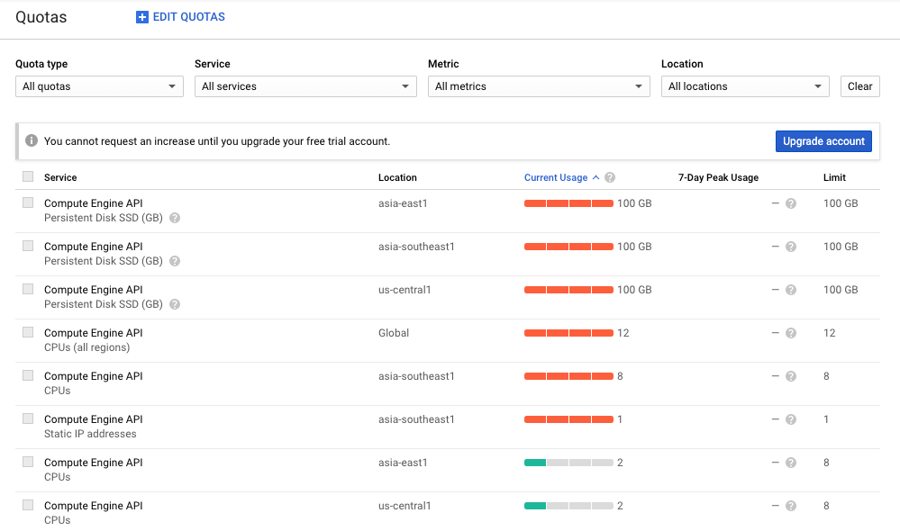

# google-or-experiments
Understand that computational limits of Google OR tools (or tools), in preparation of Hash Code 2020. Kaggle Santa series may use the following algorithms as well.

https://codingcompetitions.withgoogle.com/hashcode/archive


[TOC]


## Environment configuration

```
conda create -n hc python=3.7 -y
conda activate hc
conda install jupyter ipykernel nb_conda numpy scipy matplotlib -y
python -m pip install --upgrade --user ortools
```


To run all `.py` files

```bash
for f in ./*/*.py; 
do 
  echo "\n\n$f\n";
  python "$f"; 
done
```


<div style="page-break-after: always;"></div>

## Nature of hashcode problems

Of course, you cannot simply apply a standard optimisation algorithm to solve a hashcode problem. Also, it is not possible to obtain the optimal solution for all hashcode problems, even if the problem is open forever.

Scoring

- The lowest possible score is zero. It should be easy to find a trivial solution that satisifies the constraint, for example by submitting an almost empty solution.
- For problems with a minimisation objective (2017Q), the score is awarded for improving from the baseline solution, in this case connected directly to the data centre instead of cache servers.

Five problems

- For the qualifiers and the finals, there should be a small-size dataset, a medium-sized dataset and three large datasets.
- Each of the three large dataset should cover different cases. For 2019Q, one large dataset consists of all horizontal photos, and one large dataset consists of all vertical photos which need to be paired up into horizontal photos.
- Most of the score is derived from the three large datasets. Each of the three datasets should have a similar weightage (the possible score differs by at most two times).
- You do not need to submit the code. You can use, and likely to use different code to solve the different datasets.

Computation limits.

- The working memory of a personal computer is a few Gigabytes. There are problems that require you to compute distance matrix, and if there are 100k nodes you cannot construct a matrix of 10b elements.
- The processing speed of the computer allows calculation up to 600 million additions in a second in C or 60 millions additions in Python. When your problem formulation is successful, it is expected that a longer running time will improve your solution. In this case, you might want to free up your computer and experiment with other methods while the code is running - and this is possible by uploading your code onto platforms like Colab or Kaggle notebook to run on the cloud.

Problem modifications.

- Non-linear objective. Optimisation problems concerned here are linear problems.
- Additional objectives. Consider the vehicle routing problem with time constraints (2018Q). Bonus points were awarded if the trip happens just before the constraint.
- Preprocessing step. Consider arranging photos to maximise some score (2019Q). Two vertical photos needs to be merged into a horizontal photo before it is being considered for arrangement, and you have to formulate a certain merging strategy.


## Recommended procedures

You might want to do better than four people coding independently.

It is not possible for two people to work on the same code during the competition. However, if the groupmates use the same language, it is possible to share functions. Each person should parse the datasets themselves and parse the output themselves.

In the preliminary experiments, this is the proceudre I recommend during the qualifiers.

- One person should start with **data analysis**. This can start simple - for example noting down the size of the dataset then to more advanced analysis such as whether graphs are disjoint for example.
- One person should attempt using **optimisation tools** such as Google-OR. (I am still experimenting with this here.)
- One person should attempt solving with **competitive programming** methods.
- I do not know what to assign to the last person.

You do not need to write a judge yourself, usually. In practice rounds, a judge needs to be written. However, I no longer recommend this during the competition. You only need to write a judge when you are comparing the score for more than a hundred of solutions and your training objective is not scoring, uploading should not be too big a problem.


Preparation

- For a decent chance at entering the finals, your team need have revised all of the problems and rehearsed on a few.
- You need to understand the limits of optimisation tools. This repository is an attempt.


Use of Kaggle kernels

- If your main language is Python and your main IDE is jupyter notebook, you can use Colab or Kaggle. I prefer this because I can run up to 10 interactive notebooks and 10 commited notebooks at once.


<div style="page-break-after: always;"></div>

## Classification of optimisation problems

Optimisation problems addressed by the solver are linear problems, and all of such problems can be considered to be a integer program. However, there are specific algorithms that work on the subclass of problems, and it is usually better for multiple reasons - faster computation, less memory used, and feasible solutions is more likely to be found.


- **Mixed Integer programming**
  - **Linear programming**
    - Min-cost flow problem
      - Max-flow problem
      - Maximum cardinality matching
      - Shortest path problem
      - Transportation problem
        - Assignment problem
  - **Constraint programming (Integer)**
    - Binary programming
      - Knapsack
      - **Vehicle routing problem**
        - **Travelling Salesman problem**


<div style="page-break-after: always;"></div>

## Mixed Integer programming

> OR-Tools provides an interface to several third-party MIP solvers. The [Coin-or branch and cut (CBC)](https://projects.coin-or.org/Cbc) solver is included with OR-Tools. You can use it whether you install OR-Tools from binary or source.

Problems with the Integer Programming tool. 

- The Google-OR library MIP solver is not in-built. It calls a solver that was written in C++. Error codes that happen after the solver start solving is usually inaccurate. To report issues on Github, you need to produce an example that works on the CBC solver.
- The time limit setting does not work, in my experience. Usually, we do want a solution even if it is not optimal.
- Solutions are not replicable, in my experience. It is not because of random seeds, but feasibility.

Use of other third party tools may be considered, but the default is chosen because it is free and non-commerical.

> If you build OR-Tools from source, you can install and use any of the following third-party MIP solvers in place of CBC:
>
> - [SCIP](http://scip.zib.de/)
> - [GLPK](https://www.gnu.org/software/glpk/)
> - [Gurobi](http://www.gurobi.com/)


## Linear programming

Maximise a linear function subject to linear constraints where variables does not have integer constraints.

A linear program is an integer program where none of the decision variables or its constraints are integers. This is unlikely to happen in hashcode.


<div style="page-break-after: always;"></div>

## Constraint programming

Maximise a linear function subject to linear constraints where all variables  have integer constraints. Not sure if ortools calls other solvers.

- 2017 Quals - Online streaming (requires 10m binary parameters, I am going to try this out)

1m binary parameters takes 500 seconds to initialise.

https://www.kaggle.com/huikang/hashcode-2017-quals?scriptVersionId=28919506

We assign a score for each assignment.


## Vehicle Routing

There are many variations of the vehicle routing problem.

#### Vehicle Routing Problem
The objective is to send the cars to reach all of the locations, minimising the travel costs.

> In the Vehicle Routing Problem (VRP), the goal is to find optimal routes for multiple vehicles visiting a set of locations. (When there's only one vehicle, it reduces to the Traveling Salesman Problem.)
> 

#### Capacity Constraints
The objective here is to send the cars to pickup from all of the locations, minimising the travel costs and keeping within the limit.

> 
> The capacitated vehicle routing problem (CVRP) is a VRP in which vehicles with limited carrying capacity need to pick up or deliver items at various locations. The items have a quantity, such as weight or volume, and the vehicles have a maximum capacity that they can carry. The problem is to pick up or deliver the items for the least cost, while never exceeding the capacity of the vehicles.

#### Vehicle Routing with Pickups and Deliveries.
The objective here is to fulfill all deliveries (pickup and dropoff) while minimisng the length of the longest route.

> In this section we describe a VRP in which each vehicle picks up items at various locations and drops them off at others. The problem is to assign routes for the vehicles to pick up and deliver all the items, while minimizing the length of the longest route.
>
> 
>
> 

#### Vehicle Routing Problem with Time Windows

> Many vehicle routing problems involve scheduling visits to customers who are only available during specific time windows. These problems are known as vehicle routing problems with time windows (VRPTWs).
> The goal is to minimize the total travel time of the vehicles.
> 
> 


### Penalties and Dropping Visits
If the capacity is insufficient we can drop the visit.


### Relevant hashcode problems

- 2018Q - Self-driving rides
  
  There are three elements to this hashcode problem
  
  - It is a vehicle routing problem
  - There is a pickup location and delivery location
  - There is a time window to fulfil
  - It is not necessary to fulfill all trips
  - Bonuses are given for arriving on time
  
  Ignoring the bonuses, you need the ortools to combine three modifications - pickup-delivery, time window and allowing penalty. It is not a straightforward application, and perhaps not suitable.
  
  There is a solution online that used ortools. https://github.com/huiwang/hashcode-2018-self-driving-rides This could have obtained the 2nd place if used after the competition. However, this uses MIP to calculate assignment by assignment.
  
  > The problem is cut into sub-problems. In a sub-problem, we assign the next ride for each vehicle. We use MIP(mixed 0-1 integer programming) to solve the assignment problem.
  >
  > The objective aims to reduce the waste for an assignment. Waste is the sum of ride transition distance and waiting time.
  >
  > We include both current and future waste. Current waste measures how much it costs to start the next ride. Future waste represents the difficulty to find a new ride once we finish the next one.


<div style="page-break-after: always;"></div>

## Travelling salesman

> The *Traveling Salesman Problem (TSP)* is one of the most famous problems in computer science. In what follows, we'll describe the problem and show you how to find a solution.

Since the routing solver works over the integers, if your distance matrix has non-integer entries, you have to round the distances to integers. If some distances are small, rounding can affect the solution.

Relevant hashcode problems

- 2019 Quals - Photo slideshow

  The task is to arrange photos to achieve a maximum score. The score is the sum of pairs of photos.


In 2019Q, there are 90k nodes. The distance matrix would need to store 81b nodes, which is  The distance matrix can be calculated on demand.

Can we use the library to solve large problems? https://github.com/google/or-tools/issues/1219

> In April 2006 an instance with 85,900 points was solved using *Concorde TSP Solver*, taking over 136 CPU-years. (This seems to be finding the optimal solution)

This is me considering the merits of using ortools. 

> Memory - It is possible to avoid storing the (81b = 90k * 90k) distance matrix by defining a function. Probably can use the cloud server with large memory to store such a big matrix.
> Runtime - Tried the different options, I do not know the benefits so I use automatic. 6k nodes took 2 minutes, 12k nodes took 8 minutes, 80k nodes took = 5.5 hours. I think this is merely computing with one algorithm.
> Algorithms - Probably it will compute using the trivial methods, but the library gives us access to the more advanced methods. Maybe we can initialise a simple solution and use the library to find better solutions, one node at a time.


## ortools Limits

- Travelling salesman - 80k nodes too 5.5 hours for initial solution. https://www.kaggle.com/huikang/hashcode-2019-quals?scriptVersionId=28836490. Probably should have done it manually with a high memory notebook server.
- Vehicle routing - yet to test, on the magnitude of TSP
- Constraint programming - decent solution for 500 x 500 binary variables with 80% sparsity https://www.kaggle.com/huikang/hashcode-cp/notebook?scriptVersionId=28967736, failed for 1000 x 1000 binary variables with 80% sparsity. 1500 x 1500 binary variables zero sparity was optimised in 40 minutes, but the weights are all the same. https://www.kaggle.com/huikang/hashcode-cp?scriptVersionId=28933823
- Mixed integer programming - I do not thing you ever need to use this. Just round off the numbers and make it a constraint programming problem.


Things I think should have been solved

- Fast and good baseline solution. Many of the problems have a feasible solution. We would want good baseline solution immediately before we proceed.
- Ability to pause/stop when the solution exceeds a certain number.
- Vectorisation? Currently every variable is considered alone.
- Honestly, solvers should be smarter and learn how to prim with deep learning and AI.


## Preparation log

(I was anticipating a memory intensive algorithm, so I prepared five servers with 100GB memory each. I did not use this because there was no constraint programming involved.)

Google Cloud Free Quotas

Per region

- 8 vCPU
- 100 GB SSD drive
- Memory not regulated

Globally

- 12 vCPU



Settings used

- 2 vCPU
- 100 GB SSD
- 160 GB (entended memory)
- Upload SSH keys

Installation script (should have tested the bash script)

```bash
export LC_ALL=C
sudo apt-get update
sudo apt-get upgrade -y
sudo apt-get install git unzip python3 python3-pip python3-pandas python3-notebook jupyter jupyter-core python-ipykernel -y
pip3 install numpy scipy scikit-learn
pip3 install --upgrade --user ortools
jupyter notebook --generate-config
mkdir -p .jupyter && cd ./.jupyter && rm * && wget https://gist.githubusercontent.com/tonghuikang/5e36f80da1128d38d5c818b57ea205dd/raw/22a16c303a9ed25d6e2e2dcedd13c994fc8ff459/jupyter_notebook_config.py
cd ..

jupyter notebook
```

Connection script
```bash
ssh -N -L localhost:9000:localhost:8888 35.185.180.18
ssh -N -L localhost:9001:localhost:8888 35.189.189.148
ssh -N -L localhost:9002:localhost:8888 35.226.121.168
ssh -N -L localhost:9003:localhost:8888 34.64.167.228
ssh -N -L localhost:9004:localhost:8888 34.87.217.176
```


# Contest reflections

**Performance**

We scored **26,519,314** placing us at rank **843** out of 10714 nonzero submissions, The max score obtained is **27,203,691**. The cutoff score for finals is **27,081,995**.

For future reference, this was the insight offered after you have made every submission.

> Your submission scored **5,345,656** points.
>
> The library signup has been completed for **17 out of 1,000** libraries (1.70%). *Your submissions lists **1** more library that could not be signed up in time*. The last library signup process ended on day **683** of 700 days. Library signup took **40.24** days on average.
>
> A total of **13,072** books have been scanned. **13,072** of those books were distinct with an average score of **408.94**. This is **13.07%** of the 100,000 books available across all libraries. The minimum score of a scanned book was **1** and the maximum score of a scanned book was **800**.


**Solution framework**

The framework seems to be good for our level of expertise. The framework follows two steps

- Sort the libraries to sign up
  - Give each library a score based its properties (signup time, number of books they can deliver a day, and score of the books they have)
  - The library with the highest score will be sorted first.
- Sort the books to scan
  - The books with the highest score is scanned first. Books that are already scanned will be ignored to allow other books to be scanned.

An issue with this framework is that libraries are considered independently. Two libraries may have exactly the same books and both are awarded a high score. (We are not sure of the impact however.) In response to this, we modify the scoring algorithm

- The score is also dependent on the number of days remaining. Books that could have been scanned if there are more days are ignored in the scoring.
- The score of a book is reduced to zero when another library is going to scan the book.

This is the resulting code https://gist.github.com/tonghuikang/16afd708ed0b62240fdda86c49c249fa


**What should have been done**

We should have written a judge right at the start. There are some fine-tuning at the end that could be made more efficient with our own judge-function, and our solutions are not computationally intensive. Ultimately, these local optimisation does not increase our score too much and would only matter if we already achieved rankings very close to qualifying for finals.

Data analysis should be done better and presented. We should also learn earlier that the platform provide a set of insights to your solution. I promised to do it at the start but did not deliver :/


**What did not work out at all**

Kaggle. I could have some form of version control, result snapshot, parallel execution. The downside is that I woudl have needed to download everytime I want to submit. I could not upload the hash code dataset into Kaggle dataset, rendering the platform useless. Eventually this was not necessary because the algorithms is not computationally intensive.

High memory servers. I was preparing for a question that require memory intensive calculations. Eventually they were not used.

Google ortools. I could not find any use case for ortools. Scores are used to sort the libraries in the question.


**Effectiveness of teamwork**

We want to do better than four individual people coding independently. We do share results with each other and that is great. Everybody do not need to do everything - I do not have to be concerned with test case a, b and d.

Sharing results has helped us to progress. I also shared a rudimentary heurisitc at 3:23am that scored 2.7 million for test case f, which was improved to 5.2 million by Starla.

It would be much better if we use the same language. Here in this team we used three languages - C++, Java and Python. The problem can be broken down in a few functions, it would have made things

- Parsing function
- Library sorting function
  - Library scoring function
- Book sorting function
- Output function
- Grading function

I needed to write everything. The book sorting algorithm could been shared.

However, there are risks and complications when teammates depend on each other, and time is wasted when communicating standards. Each member who are making submissions, will need to be able to run code from input to output anyway.


All reflections here happen with the benefit of hindsight (though I have yet to read another solution).